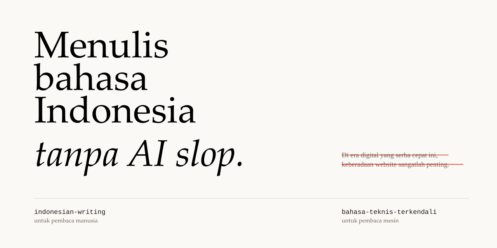

<p align="center">
  
</p>

# Indonesian Writing Skills

**[Bahasa Indonesia](README.md) | English**

Two Agent Skills for Indonesian text. One skill serves a human reader. The other skill serves a
machine reader.

| Skill | Reader | Contents |
|---|---|---|
| **`indonesian-writing`** | Human | Diction, standard word forms, EYD V, word choice, and sentences, plus guides for marketing, UX, SEO, and academic writing. No AI slop. |
| **`bahasa-teknis-terkendali`** | Machine | Controlled Indonesian: structural rules, a term list, and a mechanical checker. For tool descriptions, error messages, and instructions between agents. |

You can install both skills together. Use the skill that matches the reader of your text.

---

## Install

```bash
npx indonesian-writing-skills
```

For the latest copy directly from GitHub, without an npm publication:

```bash
npx github:pataanggs/indonesian-writing-skill
```

Or install through the skills directory of your tool (Claude Code, Cursor, and other tools):

```bash
npx skills add pataanggs/indonesian-writing-skill
```

### Options

```bash
npx indonesian-writing-skills list                        # show the available skills
npx indonesian-writing-skills --local                     # install for this project only
npx indonesian-writing-skills --skill indonesian-writing  # select one skill
npx indonesian-writing-skills --target ~/skills           # set your own target
npx indonesian-writing-skills --dry-run                   # show the plan only
```

After the install, **start a new agent session**. The agent reads the skill in the new session.

### Manual install

Copy the contents of the `skills/` folder to the skills directory of your agent. Then start a
new session.

| Agent | Directory |
|---|---|
| Command Code | `~/.commandcode/skills/` |
| Claude Code | `~/.claude/skills/` |
| Other tools | the skills location of your tool, for example `~/.agents/skills/` |

```bash
git clone https://github.com/pataanggs/indonesian-writing-skill
cp -r indonesian-writing-skill/skills/* ~/.commandcode/skills/
```

---

## Use

The skills trigger on their own. You do not call the skill name. Only make the request. The
skill reacts to the request in Indonesian or in English.

| Request | Skill that runs |
|---|---|
| "Perbaiki tulisan ini" · "Bikin lebih natural" · "Cek AI slop-nya" · "Rapikan ejaannya" | `indonesian-writing` |
| "Tulis ulang supaya agen tidak salah paham" · "Rapikan pesan galat ini" · "Pakai bahasa teknis terkendali" | `bahasa-teknis-terkendali` |

---

## Checkers

Each skill includes a mechanical checker for the patterns that a fast read misses. The
checkers have no dependencies and need Node 18 or later.

```bash
node skills/indonesian-writing/scripts/check.mjs draf.md
node skills/bahasa-teknis-terkendali/scripts/lint.mjs draf.md
```

Both commands exit with code 1 when they find an issue. Run `--help` to see the options.

The output is a filter, not a judge. Some patterns are correct in some contexts, so a human
must look at each finding.

---

## Tests

```bash
npm test
```

79 tests: the anti-slop checker, the controlled-language checker, and the installer.

---

## Structure

```
indonesian-writing-skill/
├── skills/
│   ├── indonesian-writing/          # for the human reader
│   └── bahasa-teknis-terkendali/    # for the machine reader
├── sumber/                          # all references, with reliability notes
├── assets/                          # banner
├── README.md · ATTRIBUTION.md · LICENSE
```

`skills/` is the only folder that the installer copies. `sumber/` holds reference documentation
and does not go into the install.

---

## Notes

- **This repository corrects the EYD V rules.** Three claims that circulate widely in other
  packages do not match the official text: title capitalization, the dash that sets off an
  explanation, and the space around a dash. The notes in
  [`sumber/verifikasi-langsung.md`](sumber/verifikasi-langsung.md) quote the official text.
- **`bahasa-teknis-terkendali` is not ASD-STE100** and has no affiliation with ASD or STEMG.
  ASD owns that standard, and this repository does not reproduce it.
- **The Indonesian slop markers are qualitative.** No corpus study exists for Indonesian. The
  only marker that native speakers validated is "hiruk pikuk". Details are in
  [`sumber/ai-slop.md`](sumber/ai-slop.md).
- **This repository records every reference.** The [`sumber/`](sumber/) folder holds all
  sources used, with a quality marker for each one. The notes in `sumber/` are in Indonesian.

## License

MIT. See [LICENSE](LICENSE) and [ATTRIBUTION.md](ATTRIBUTION.md).
